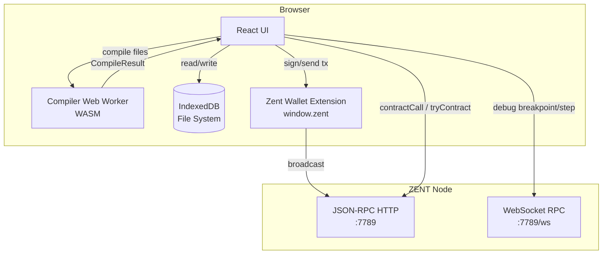
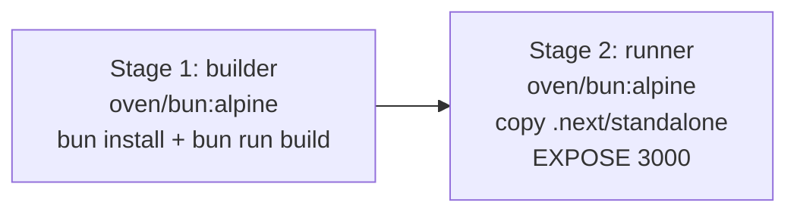

# SmallC IDE

> A web-based development environment for the SmallC (smart contract language), running on the Zent blockchain.

---

## Table of Contents

- [Overview](#overview)
- [Features](#features)
- [Tech Stack](#tech-stack)
- [Architecture](docs/ARCHITECTURE.md)
- [Getting Started](#getting-started)
- [Deployment](#deployment)
- [Reference](#reference)

---

## Overview

SmallC IDE provides a browser-native environment to write, compile, debug and deploy SmallC smart contracts to the Zent blockchain. The compiler runs inside a **WebAssembly worker** so no server round-trip is needed for compilation. Deployment and debugging communicate directly with the Zent node via JSON-RPC (HTTP) and WebSocket.

---

## Features

| Feature       | Description                                            |
| ------------- | ------------------------------------------------------ |
| Code editor   | Monaco editor with SmallC syntax highlighting          |
| File explorer | IndexedDB-backed virtual file system                   |
| Compilation   | In-browser WASM compiler via Web Worker                |
| ASM assembler | Client-side SmallC assembler (`Asm` class)             |
| Deploy        | Sign & broadcast contract transactions via Zent wallet |
| Debug         | Source-level step debugger over WebSocket RPC          |
| Console       | Searchable, auto-scrolling log panel                   |
| Wallet        | Zent browser-extension wallet integration              |
| Multi-network | ZENT Testnet and local node support                    |

---

## Tech Stack

| Layer            | Technology                                        |
| ---------------- | ------------------------------------------------- |
| Framework        | Next.js 15 (App Router)                           |
| Language         | TypeScript 5 (strict mode)                        |
| UI               | React 19 + Tailwind CSS v4 + shadcn/ui + Radix UI |
| State            | Zustand 5                                         |
| HTTP client      | Axios                                             |
| Code editor      | Monaco Editor 0.45                                |
| Compiler runtime | WebAssembly (Web Worker)                          |
| File storage     | IndexedDB via `@isomorphic-git/lightning-fs`      |
| Crypto           | `crypto-js` (SHA256, RIPEMD160)                   |
| Linting          | gts (ESLint + Prettier)                           |
| Package manager  | Bun                                               |

---

## Architecture

### System Overview



Full architecture documentation: [docs/ARCHITECTURE.md](docs/ARCHITECTURE.md)

---

## Getting Started

### Prerequisites

| Tool    | Version   |
| ------- | --------- |
| Node.js | >= 20.0.0 |
| Bun     | >= 1.1.10 |
| Git     | >= 2.41.0 |

### Install

```bash
git clone https://github.com/ledboot/smallc-ide.git
cd smallc-ide
bun install
```

### Develop

```bash
bun run dev
```

Open http://localhost:3000.

### Lint / Format

```bash
bun run lint      # ESLint via gts
bun run fix       # Auto-fix lint issues
```

### Build

```bash
bun run build
bun run start
```

---

## Deployment

### Docker (recommended)

```bash
# Build and run
docker compose up -d

# Or build manually
docker build -t smallc-ide .
docker run -p 3000:3000 smallc-ide
```

`docker-compose.yml` pulls `docker.io/ledboot/smallc-ide:latest` and exposes port `3000`.

The Dockerfile uses a two-stage build:



### Environment Variables

| Variable                  | Default       | Description               |
| ------------------------- | ------------- | ------------------------- |
| `NODE_ENV`                | `development` | Node environment          |
| `NEXT_TELEMETRY_DISABLED` | `1`           | Disable Next.js telemetry |
| `PORT`                    | `3000`        | Listening port (Docker)   |

---

## Reference

### Developer API

Full API reference for all built-in classes, utilities and state stores has been moved to:

→ Full reference [docs/DEVELOPER_API.md](docs/DEVELOPER_API.md)

---

### TS Script Runtime API

Documents the in-IDE TypeScript contract script execution environment: entry-point conventions, the injected `walletApi` global, built-in utilities (`MsgT`, `Address`, `Packer`, …), `console` output, available `require` modules and return-value recommendations.

→ Full reference: [docs/TS_SCRIPT_API.md](docs/TS_SCRIPT_API.md)
