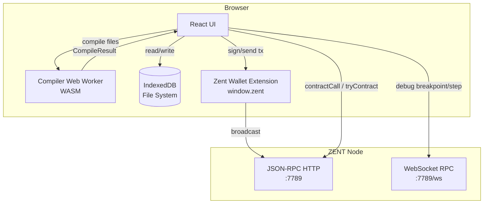
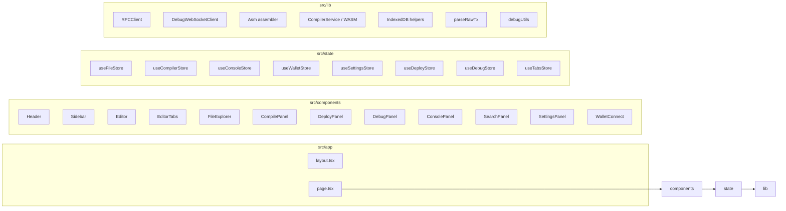
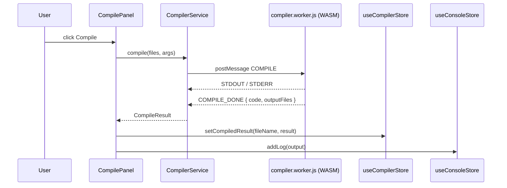
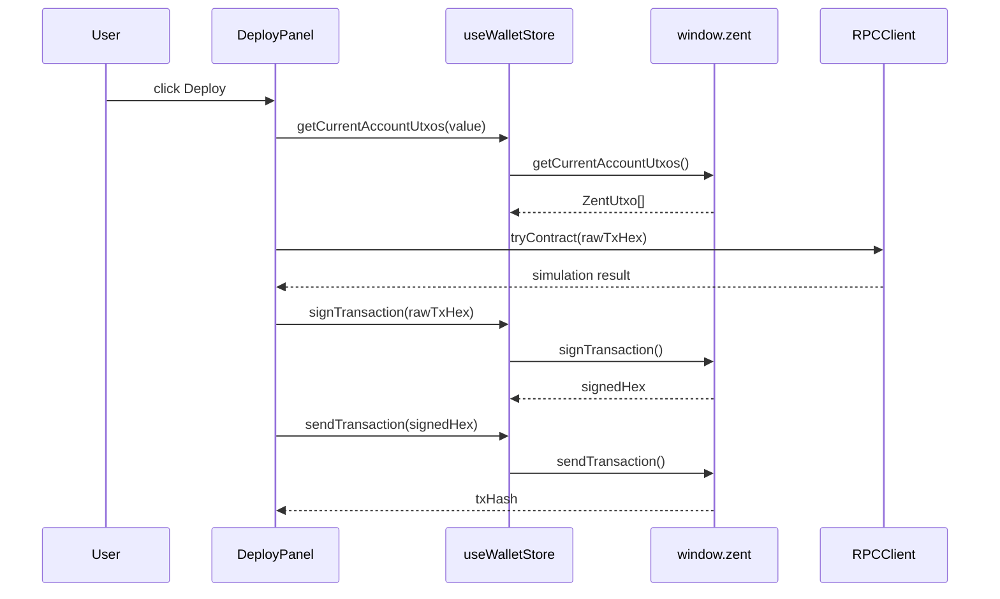
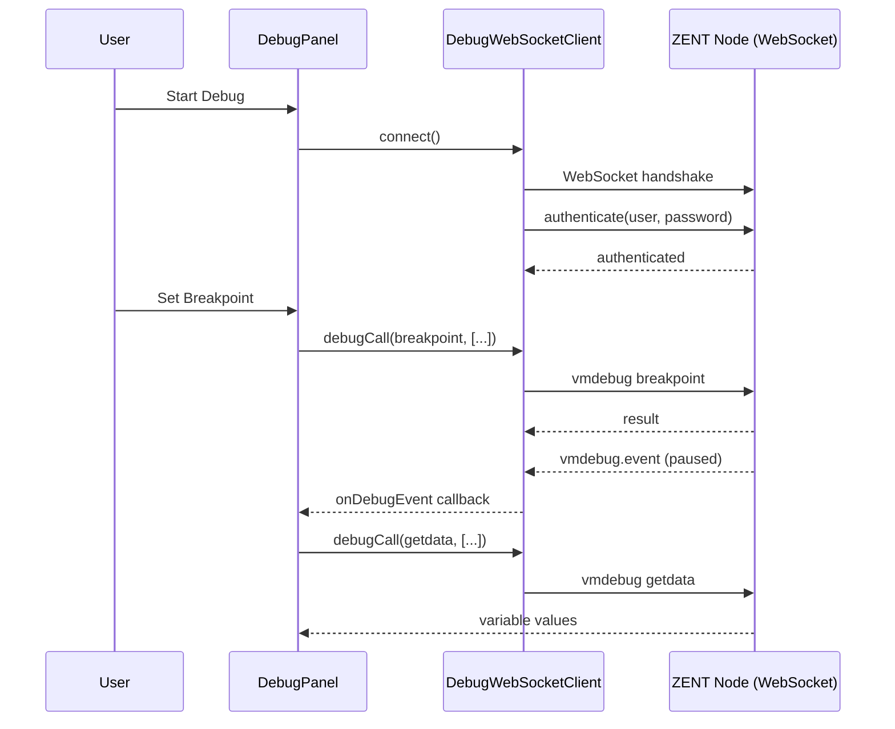
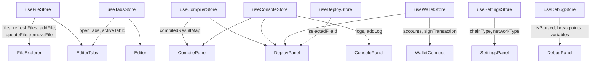

# Architecture

## System Overview

```mermaid
graph TB
    subgraph Browser
        UI[React UI]
        WW[Compiler Web Worker<br/>WASM]
        IDB[(IndexedDB<br/>File System)]
        EXT[Zent Wallet Extension<br/>window.zent]
    end

    subgraph ZENT Node
        RPC[JSON-RPC HTTP<br/>:7789]
        WS[WebSocket RPC<br/>:7789/ws]
    end

    UI -->|compile files| WW
    WW -->|CompileResult| UI
    UI -->|read/write| IDB
    UI -->|sign/send tx| EXT
    EXT -->|broadcast| RPC
    UI -->|contractCall / tryContract| RPC
    UI -->|debug breakpoint/step| WS
```

## Frontend Layer Structure

```mermaid
graph LR
    subgraph src/app
        layout[layout.tsx]
        page[page.tsx]
    end

    subgraph src/components
        Header
        Sidebar
        Editor
        EditorTabs
        FileExplorer
        CompilePanel
        DeployPanel
        DebugPanel
        ConsolePanel
        SearchPanel
        SettingsPanel
        WalletConnect
    end

    subgraph src/state
        useFileStore
        useCompilerStore
        useConsoleStore
        useWalletStore
        useSettingsStore
        useDeployStore
        useDebugStore
        useTabsStore
    end

    subgraph src/lib
        api[RPCClient]
        ws[DebugWebSocketClient]
        asm[Asm assembler]
        compiler[CompilerService / WASM]
        db[IndexedDB helpers]
        txdecode[parseRawTx]
        debugUtils[debugUtils]
    end

    page --> components
    components --> state
    state --> lib
```

## Compile Flow

```mermaid
sequenceDiagram
    participant User
    participant CompilePanel
    participant CompilerService
    participant Worker as compiler.worker.js (WASM)

    User->>CompilePanel: click Compile
    CompilePanel->>CompilerService: compile(files, args)
    CompilerService->>Worker: postMessage COMPILE
    Worker-->>CompilerService: STDOUT / STDERR
    Worker-->>CompilerService: COMPILE_DONE { code, outputFiles }
    CompilerService-->>CompilePanel: CompileResult
    CompilePanel->>useCompilerStore: setCompiledResult(fileName, result)
    CompilePanel->>useConsoleStore: addLog(output)
```

## Deploy Flow

```mermaid
sequenceDiagram
    participant User
    participant DeployPanel
    participant useWalletStore
    participant ZentExtension as window.zent
    participant RPCClient

    User->>DeployPanel: click Deploy
    DeployPanel->>useWalletStore: getCurrentAccountUtxos(value)
    useWalletStore->>ZentExtension: getCurrentAccountUtxos()
    ZentExtension-->>useWalletStore: ZentUtxo[]
    DeployPanel->>RPCClient: tryContract(rawTxHex)
    RPCClient-->>DeployPanel: simulation result
    DeployPanel->>useWalletStore: signTransaction(rawTxHex)
    useWalletStore->>ZentExtension: signTransaction()
    ZentExtension-->>useWalletStore: signedHex
    DeployPanel->>useWalletStore: sendTransaction(signedHex)
    useWalletStore->>ZentExtension: sendTransaction()
    ZentExtension-->>DeployPanel: txHash
```

## Debug Flow

```mermaid
sequenceDiagram
    participant User
    participant DebugPanel
    participant DebugWSClient as DebugWebSocketClient
    participant Node as ZENT Node (WebSocket)

    User->>DebugPanel: Start Debug
    DebugPanel->>DebugWSClient: connect()
    DebugWSClient->>Node: WebSocket handshake
    DebugWSClient->>Node: authenticate(user, password)
    Node-->>DebugWSClient: authenticated

    User->>DebugPanel: Set Breakpoint
    DebugPanel->>DebugWSClient: debugCall(breakpoint, [...])
    DebugWSClient->>Node: vmdebug breakpoint
    Node-->>DebugWSClient: result

    Node-->>DebugWSClient: vmdebug.event (paused)
    DebugWSClient-->>DebugPanel: onDebugEvent callback
    DebugPanel->>DebugWSClient: debugCall(getdata, [...])
    DebugWSClient->>Node: vmdebug getdata
    Node-->>DebugPanel: variable values
```

## State Management

```mermaid
graph TD
    useFileStore -->|"files, refreshFiles, addFile,\nupdateFile, removeFile"| FileExplorer
    useFileStore --> EditorTabs
    useTabsStore -->|"openTabs, activeTabId"| EditorTabs
    useTabsStore --> Editor
    useCompilerStore -->|compiledResultMap| CompilePanel
    useCompilerStore --> DeployPanel
    useConsoleStore -->|"logs, addLog"| ConsolePanel
    useConsoleStore --> CompilePanel
    useConsoleStore --> DeployPanel
    useWalletStore -->|"accounts, signTransaction"| WalletConnect
    useWalletStore --> DeployPanel
    useSettingsStore -->|"chainType, networkType"| SettingsPanel
    useDeployStore -->|selectedFileId| DeployPanel
    useDebugStore -->|"isPaused, breakpoints, variables"| DebugPanel
```
